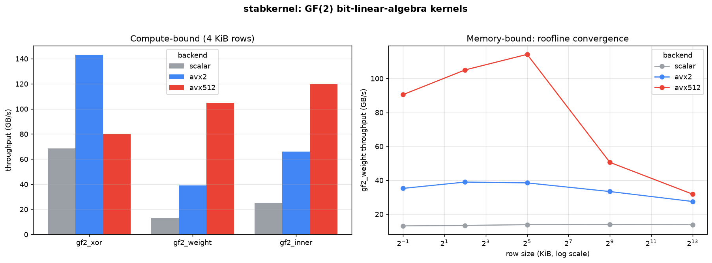
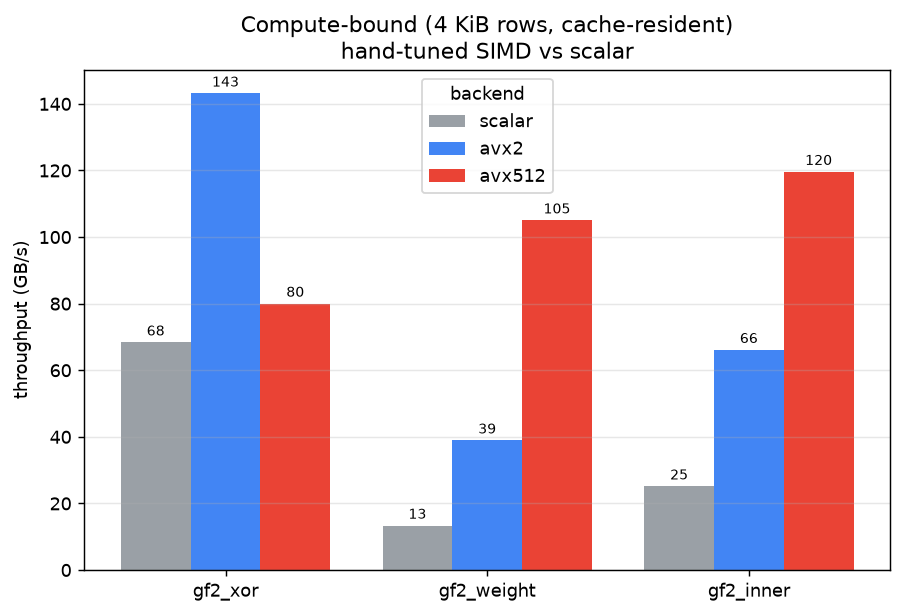
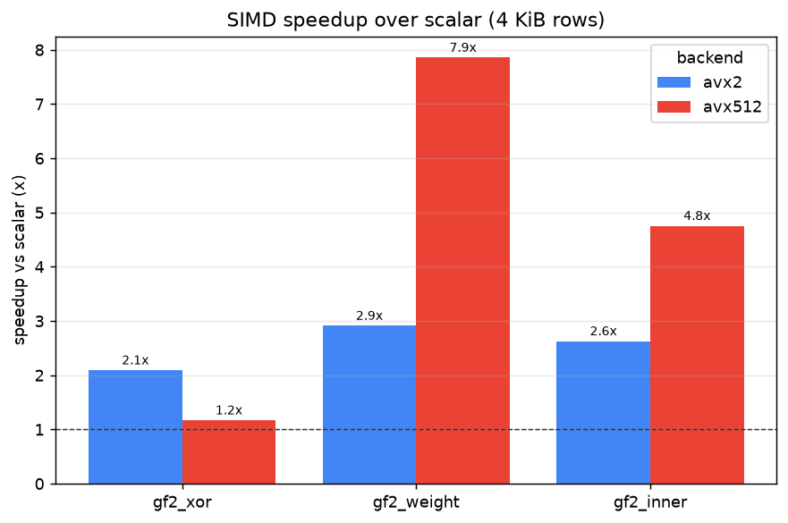
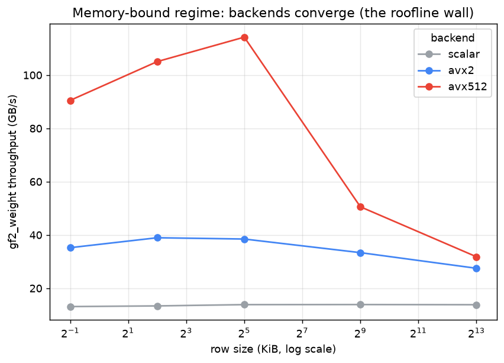
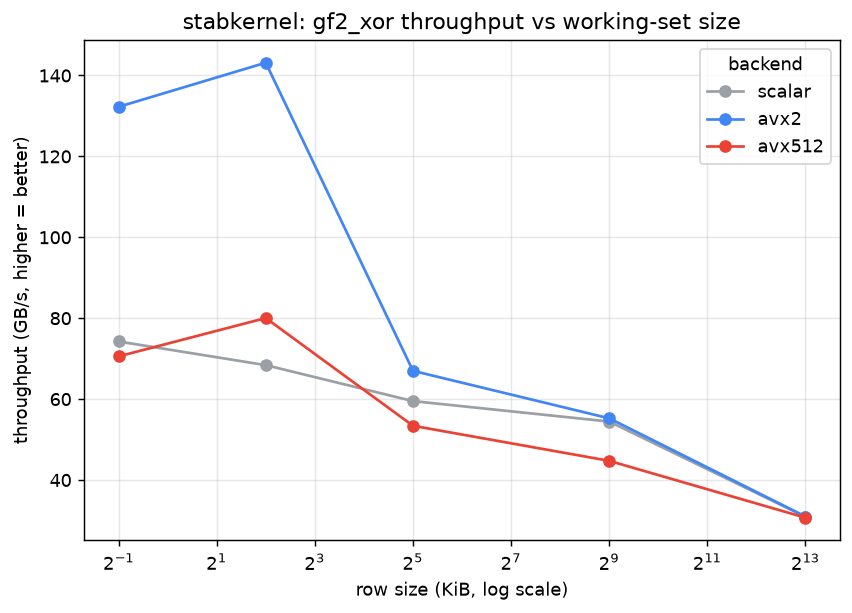
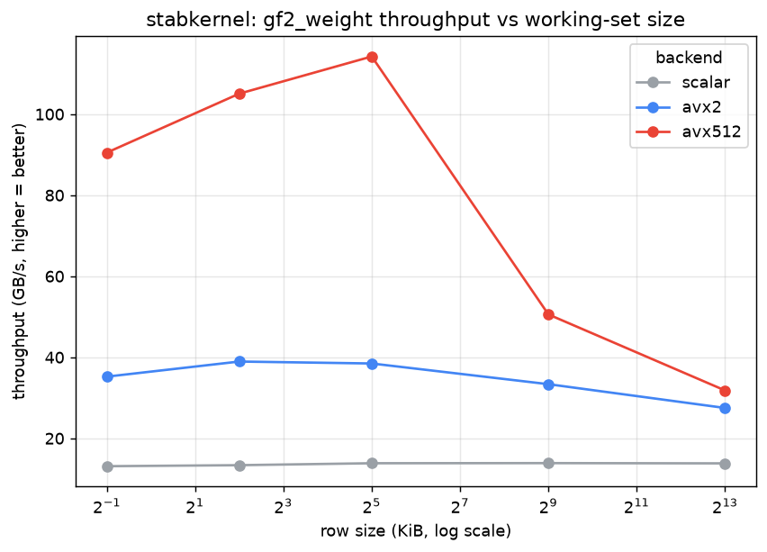
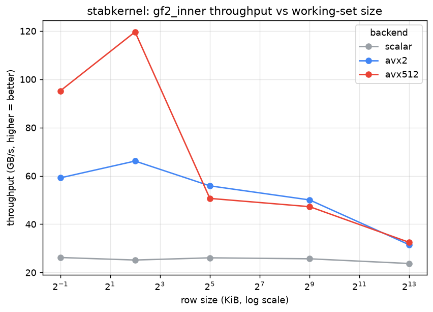

# stabkernel

**Hand-tuned assembly kernels for GF(2) / stabilizer bit-linear-algebra**, with a
portable dispatch layer that picks the fastest implementation per CPU:

| Family | ISA tier | Kernel source | Status |
|---|---|---|---|
| Intel (Skylake-X, Ice/Sapphire Rapids), **AMD Zen4 / Zen5** | AVX-512 F + VPOPCNTDQ | `src/gf2_x86.S` | ✅ built & tested in CI sandbox |
| Intel Haswell+, **AMD Zen1–Zen3** | AVX2 (+ PSHUFB popcount LUT) | `src/gf2_x86.S` | ✅ built & tested in CI sandbox |
| **Apple M1–M4**, AWS Graviton, **Android arm64-v8a**, other ARM64 | NEON (CNT / UADDLP) | `src/gf2_arm.S` | ✅ built in CI (Linux/macOS/Android); validated on macOS arm64 runners |
| **Android armeabi-v7a** (32-bit ARM) | portable C (`__builtin_popcountll`) | `src/gf2_scalar.c` | ✅ cross-built in CI |
| anything else | portable C (`__builtin_popcountll`) | `src/gf2_scalar.c` | ✅ always available |

Backend is chosen at load time via CPUID (x86) / baseline NEON (aarch64), and
can be pinned with `STABKERNEL_BACKEND=scalar|avx2|avx512|neon` for testing.

The `.S` kernels are assembled portably across ELF (Linux / Android) and Mach-O
(macOS): C symbols are emitted with the platform's name-mangling and the
non-executable-stack note is ELF-only, so the same source builds under gcc,
Apple clang, MinGW, and the Android NDK with no per-platform edits.

## Installation

```sh
pip install stabkernel
```

Requires Python ≥ 3.8 and numpy. On Linux / macOS this installs a prebuilt wheel
(no compiler needed) where available; otherwise pip builds from the source
distribution, which needs a C compiler with OpenMP (gcc or clang).

**From source / for development:**

```sh
git clone https://github.com/AshiteshSingh/stabkernel.git
cd stabkernel
make              # builds libstabkernel.so + runs the correctness tests
pip install -e .  # editable install of the Python package
python -m stabkernel   # smoke test: prints backend, cores, and matmul: OK
```

Pin a backend with `STABKERNEL_BACKEND=scalar|avx2|avx512`, or cap threads with
`OMP_NUM_THREADS=N`.

## Why these kernels are worth writing in assembly

Most array code is *memory-bandwidth-bound*, where hand assembly buys nothing.
These three primitives are the exception: they are the tiny, hot, endlessly-reused
inner loops of Clifford / stabilizer simulation, and two of them are
*compute-bound* bit-manipulation loops that compilers vectorize poorly.

| Kernel | What it is | Used for |
|---|---|---|
| `gf2_xor(dst, src, n)` | `dst[i] ^= src[i]` | GF(2) row-add, Clifford tableau update, Pauli-frame propagation |
| `gf2_inner(a, b, n)` | `parity(Σ popcount(a[i] & b[i]))` | symplectic / stabilizer commutation product |
| `gf2_weight(a, n)` | `Σ popcount(a[i])` | Pauli weight, stabilizer-Rényi / magic statistics |

Built on top (portable C orchestration, BLIS-style):

- `gf2_rank(rows, m, nwords)` — in-place GF(2) Gaussian elimination / rank; the
  engine behind Gauss-sum stabilizer-overlap evaluation.

## Multi-core layer — every core of the CPU

SIMD extracts the power of *one* core; this layer fans the work across *all* of
them via OpenMP. The headline is `gf2_matmul`, a GF(2) matrix multiply using the
**Method of the Four Russians** (Gray-code table of row combinations) on top of
the SIMD `gf2_xor`, parallelised over output rows so throughput scales with core
count.

| Function | What it does | Parallelism |
|---|---|---|
| `gf2_matmul(A,Aw,B,Bw,C,m,k)` | `C = A·B` over GF(2), bit-packed | four-Russians + SIMD, all cores |
| `gf2_weight_many(rows,m,nw,out)` | weight of each of `m` rows | all cores |
| `gf2_xor_many(rows,m,nw,vec)` | `rows[i] ^= vec` for all rows | all cores |
| `stabkernel_num_threads()` | cores the library will use | — |

Complexity: four-Russians turns the naive `O(m·k)` row-XORs into
`O(m·k/t + (k/t)·2^t)` (block size `t = 8`), **independent of bit density** — so
it is faster than one XOR per set bit *and* embarrassingly parallel.

**Measured scaling** (`make scale`, GF(2) matmul 4096×4096×4096 = 6.87e10 bit-ops):

| machine | backend | 1 thread | all cores | speedup |
|---|---|---|---|---|
| 2-core AVX2 box | avx2 | 1017 bit-GOP/s | **1732 bit-GOP/s** | **1.70×** on 2 cores |

Scaling is near-linear in cores until memory bandwidth saturates; on a many-core
EPYC / Xeon / M-series the same code keeps climbing. Pin threads with
`OMP_NUM_THREADS=N`, or build with `make NATIVE=1` for `-march=native`.

## Measured results (Intel Xeon, AVX-512, this build)

Same machine, three backends pinned via env var. Throughput in GB/s (higher is
better). Full data in `bench/results.csv`; charts written by `bench/plot.py`
(see the list under Build & test).

**Compute-bound (4 KiB rows, L1-resident) — assembly wins:**

| kernel | scalar | AVX2 | AVX-512 | best speedup |
|---|---|---|---|---|
| `gf2_weight` | 13.4 | 39.0 | **105.1** | **7.9×** |
| `gf2_inner`  | 25.2 | 66.2 | **119.6** | **4.8×** |
| `gf2_xor`    | 68.4 | **143.2** | 80.0 | **2.1×** |

**Memory-bound (8 MiB rows) — the roofline wall:**

| kernel | scalar | AVX2 | AVX-512 |
|---|---|---|---|
| `gf2_weight` | 13.8 | 27.5 | 31.8 |
| `gf2_xor`    | 30.9 | 31.0 | 30.7 |
| `gf2_inner`  | 23.7 | 31.5 | 32.5 |

Once the working set leaves cache, every backend converges to ~30 GB/s — no
amount of instruction-level tuning beats memory bandwidth. This is the honest,
measured boundary of where hand assembly helps: **the compute-bound popcount
kernels (`gf2_weight`, `gf2_inner`), not the bandwidth-bound `gf2_xor`.**

> Note: `gf2_xor` and `gf2_inner` on AVX-512 dip below AVX2 at some sizes on this
> Xeon (AVX-512 license-based downclocking on a bandwidth-bound op). The dispatch
> logic still prefers AVX-512 because `gf2_weight` — the dominant cost in magic /
> stabilizer-Rényi sweeps — is ~2× faster there. Per-kernel tier selection is a
> natural next step.

## Benchmark charts

Generated by `bench/plot.py` from `bench/results.csv`. Regenerate on your own CPU
with `bash bench/sweep.sh > bench/results.csv && python3 bench/plot.py` — the
plotter adapts to whichever backends your machine has (scalar / AVX2 / AVX-512).

**Overview — compute-bound bars + memory-bound roofline**



**Backend comparison at a cache-resident size (scalar vs SIMD)**



**SIMD speedup over the scalar baseline** — the honest win is on the compute-bound
popcount kernels (`gf2_weight`, `gf2_inner`); `gf2_xor` is bandwidth-bound and the
compiler already vectorizes it.



**Roofline — `gf2_weight` vs working-set size** (all backends converge once data
leaves cache)



**Per-kernel throughput vs working-set size**







## Build & test

```sh
make            # builds libstabkernel.so, runs correctness tests + benchmark
make NATIVE=1   # same, plus -march=native -funroll-loops (max speed on host)
make test       # correctness only (SIMD backends vs scalar reference)
make bench      # build the benchmark binaries
make scale      # multi-core scaling report (1 -> all cores) for gf2_matmul
bash bench/sweep.sh > bench/results.csv   # full single-core size sweep
python3 bench/plot.py                      # render the PNG charts (below)
```

`plot.py` writes one PNG per chart into `bench/` (robust to whichever backends
your CPU has):

- `throughput_gf2_xor.png`, `throughput_gf2_weight.png`, `throughput_gf2_inner.png` — throughput vs row size, per kernel
- `compute_bound_bars.png` — per-kernel bars at a cache-resident size
- `roofline_gf2_weight.png` — memory-bound convergence
- `speedup_vs_scalar.png` — SIMD speedup over the scalar baseline
- `overview.png` — combined 2-panel summary

Pass a custom CSV with `python3 bench/plot.py path/to/results.csv`.

OpenMP (`-fopenmp`) drives the multi-core layer; if your compiler lacks it the
library still builds and runs correctly single-threaded.

Correctness is checked for every backend against the scalar reference across
length classes 0..65537 words (covering all SIMD tail cases), plus `gf2_rank`
sanity checks. On x86-64 all three backends report `ALL TESTS PASSED`.

## Python

```python
import numpy as np
import stabkernel as sk

a = np.random.default_rng().integers(0, 2**64, size=64, dtype=np.uint64)
b = np.random.default_rng().integers(0, 2**64, size=64, dtype=np.uint64)
print(sk.backend())     # 'avx512' | 'avx2' | 'neon' | 'scalar'
print(sk.weight(a))     # Hamming weight
print(sk.inner(a, b))   # GF(2) symplectic inner product (0/1)
sk.xor_into(a, b)       # a ^= b, in place
print(sk.rank(np.random.default_rng().integers(0, 2**64, size=(50,4), dtype=np.uint64)))
```

## API reference

All vectors are bit-packed `uint64` numpy arrays: a length-`nbits` GF(2) vector
is `ceil(nbits/64)` little-endian words (see Bit-packing convention below).

### Python (`import stabkernel as sk`)

| Function | Signature | Returns | Description |
|---|---|---|---|
| `backend` | `sk.backend()` | `str` | Active backend: `'avx512'`, `'avx2'`, `'neon'`, or `'scalar'`. |
| `num_threads` | `sk.num_threads()` | `int` | CPU cores the multi-core kernels will use. |
| `weight` | `sk.weight(a)` | `int` | Total Hamming weight, the sum of popcounts. |
| `inner` | `sk.inner(a, b)` | `int` | GF(2) symplectic inner product `parity(sum popcount(a & b))` — 0 or 1. |
| `xor_into` | `sk.xor_into(dst, src)` | `array` | In-place `dst ^= src`; `dst` must be contiguous `uint64`. |
| `rank` | `sk.rank(matrix)` | `int` | GF(2) rank of a 2D `(m x nwords)` bit-matrix. |
| `matmul` | `sk.matmul(A, B, k)` | `array` | GF(2) matmul `C = A.B` (four-Russians, all cores). `A: (m, ceil(k/64))`, `B: (k, Bw)` -> `C: (m, Bw)`. |
| `__version__` | `sk.__version__` | `str` | Package version. |

Every function carries a docstring — run `help(stabkernel)` or `help(sk.matmul)`
for details.

### C / C++ (`#include "gf2kernel.h"`, link `-lstabkernel`)

| Symbol | Signature | Description |
|---|---|---|
| `gf2_xor` | `void gf2_xor(uint64_t *dst, const uint64_t *src, size_t nwords)` | `dst[i] ^= src[i]` (runtime-dispatched). |
| `gf2_inner` | `uint64_t gf2_inner(const uint64_t *a, const uint64_t *b, size_t nwords)` | Symplectic inner product -> 0/1. |
| `gf2_weight` | `uint64_t gf2_weight(const uint64_t *a, size_t nwords)` | Hamming weight. |
| `gf2_rank` | `size_t gf2_rank(uint64_t *rows, size_t m, size_t nwords)` | In-place GF(2) Gaussian elimination; returns rank. |
| `gf2_matmul` | `void gf2_matmul(const uint64_t *A, size_t Aw, const uint64_t *B, size_t Bw, uint64_t *C, size_t m, size_t k)` | GF(2) matmul, four-Russians + OpenMP. |
| `gf2_weight_many` | `void gf2_weight_many(const uint64_t *rows, size_t m, size_t nwords, uint64_t *out)` | Per-row weight, parallel. |
| `gf2_xor_many` | `void gf2_xor_many(uint64_t *rows, size_t m, size_t nwords, const uint64_t *vec)` | `rows[i] ^= vec`, parallel. |
| `stabkernel_backend` | `const char *stabkernel_backend(void)` | Active backend name. |
| `stabkernel_init` | `void stabkernel_init(void)` | Force backend (re)detection. |
| `stabkernel_num_threads` | `int stabkernel_num_threads(void)` | Threads OpenMP will use. |

Full prototypes and semantics are documented in `include/gf2kernel.h`.

## Bit-packing convention

A length-`nbits` GF(2) vector is `ceil(nbits/64)` little-endian `uint64` words;
bit *j* lives in word *j/64*, position *j%64*. Zero the unused trailing bits so
`gf2_weight` / `gf2_inner` stay meaningful.

## Layout

```
include/gf2kernel.h    public API
src/gf2_scalar.c       portable reference (also the fallback + test oracle)
src/gf2_x86.S          AVX-512 + AVX2 hand-written kernels (Intel/AMD)
src/gf2_arm.S          NEON hand-written kernels (Apple Silicon / ARM64)
src/dispatch.c         CPUID feature detection + backend selection
src/wrappers.c         stable C entry points for language bindings
src/gf2_linalg.c       GF(2) rank / Gaussian elimination on the kernels
src/gf2_parallel.c     multi-core layer: gf2_matmul (four-Russians), batched ops
tests/test_correctness.c
bench/bench.c          single-core kernel throughput
bench/bench_parallel.c multi-core matmul scaling (1 -> all cores)
bench/sweep.sh, plot.py
python/stabkernel.py   zero-copy numpy ctypes bindings (incl. matmul)
```

## Roadmap (honest status)

- [x] x86-64 AVX-512 / AVX2 / scalar kernels, tested
- [x] AArch64 NEON kernels (need on-device validation + benchmarks)
- [ ] Per-kernel tier selection (prefer AVX2 for bandwidth-bound `gf2_xor`)
- [ ] AVX-512 GFNI / VPCLMULQDQ path for batched symplectic products
- [ ] ARM SVE2 tier (Graviton3+/newer cores)
- [x] Multi-core layer (OpenMP): four-Russians `gf2_matmul`, batched weight/xor
- [ ] Batched multi-row Pauli-frame kernel (Stim-style shot batching)
- [ ] Benchmarks vs Stim's intrinsics C++ on the same operations

## License

MIT (see LICENSE).
